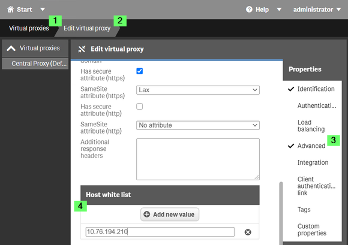
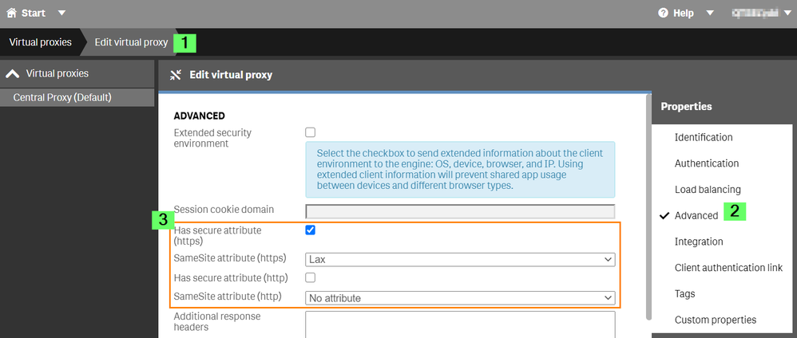

# Table

> This example requires access to Qlik Sense Enterprise on Windows using build tool.

## With Qlik Sense Enterprise on Windows

- [Deploying Qlik Sense Enterprise on Windows (QSEoW)](https://help.qlik.com/en-US/sense-admin/May2022/Subsystems/DeployAdministerQSE/Content/Sense_DeployAdminister/QSEoW/Deploy_QSEoW/Qlik-Sense-installation.htm)
- [Log in to the Qlik Management Console (QMC)](https://help.qlik.com/en-US/sense-admin/May2022/Subsystems/DeployAdministerQSE/Content/Sense_DeployAdminister/QSEoW/Administer_QSEoW/Managing_QSEoW/start-the-QMC.htm)
- Import the `Executive_Dashboard.qvf` app from `data/apps` into QMC Apps.
- Add a dev url(such as localhost:4200) to the [**virtual proxy host white list**](https://help.qlik.com/en-US/sense-admin/May2022/Subsystems/DeployAdministerQSE/Content/Sense_DeployAdminister/QSEoW/Administer_QSEoW/Managing_QSEoW/virtual-proxies-overview.htm)
  
- Set the [**SameSite https attribute**](https://help.qlik.com/en-US/sense-admin/May2022/Subsystems/DeployAdministerQSE/Content/Sense_DeployAdminister/QSEoW/Administer_QSEoW/Managing_QSEoW/SameSite-attribute.htm) from Lax to None
  
- Just open your_QSEoW_url/hub and login with your credential, then open a new browser tab with your mashup at the dev url. In this way you are sure that you are already authenticated

## More relevant info

[How to configure the WebSocket origin allow list and best practices](https://community.qlik.com/t5/Knowledge/How-to-configure-the-WebSocket-origin-allow-list-and-best/ta-p/1716765)
[Error message: Connection lost is displayed when I try to connect to the Qlik Sense hub](https://help.qlik.com/en-US/sense-admin/May2022/Subsystems/DeployAdministerQSE/Content/Sense_DeployAdminister/QSEoW/Administer_QSEoW/Managing_QSEoW/troubleshooting-managing-QMC.htm)
